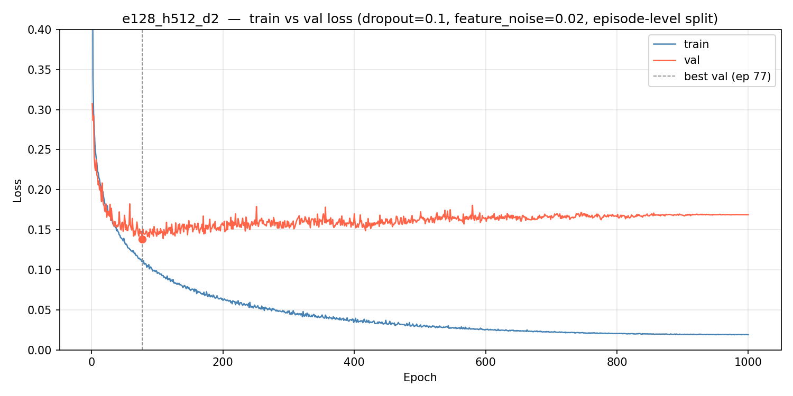

# Robot Arm Action Head - 20260425

Remote output root: `/u701/tevillen/robot-arm/data/`
Cluster logs: `/u701/tevillen/robot-arm/logs/`

## Motivation

Train a next-action prediction model for a 4-DOF robot arm (XYZ deltas + gripper open/close) using frozen V-JEPA 2-AC as the visual encoder. Prior VLA attempts overfit badly. The goal here is a frozen encoder + small trainable MLP head that generalises well despite limited data (~65 episodes, ~36K training windows).

V-JEPA 2-AC (Meta, 2025) is a ViT-g/16 JEPA world model pretrained on 1M+ hours of video and 62 hours of DROID robot manipulation data. Its 1408-dim features are extracted once and cached to disk; all training runs use the cached features and never touch the GPU encoder again.

## Architecture

```
frozen V-JEPA 2-AC encoder  (ViT-g/16, ~1B params, not updated)
  → mean-pool patch tokens     → (B, 1408)
  → Linear + LayerNorm         → (B, embed_dim)          [projection]
  → concat robot state         → (B, embed_dim + 4)
  → MLP (depth × hidden_dim)   → (B, 4)                  [action head]
```

Output: `[dx, dy, dz, gripper_logit]`
Loss: MSE on XYZ deltas + BCEWithLogitsLoss on binary gripper state `{0=open, 1=closed}`

Data: 3 sessions — `simple_session_few` (5 eps), `teleop_session` (25 eps), `teleop_session_alex` (35 eps)

---

## Sweep 1 — Architecture Ablation (SLURM array 1733–1740)

### Changes vs prior run

Previous run (100 epochs, window-level val split, no regularisation) found e64_h128_d1 least overfit. Three changes:

1. **Episode-level val split** — window-level split was leaky (adjacent windows from the same episode could straddle the boundary). Now entire episodes are held out.
2. **Dropout 0.1** in every MLP hidden layer.
3. **Feature noise σ=0.02** during training (cheap augmentation without re-running the encoder).
4. **1000 epochs** with cosine LR to see plateau behaviour.

### Common settings

- Feature cache: `feature_cache.pt` (36,674 windows, dim=1408)
- Val split: episode-level, `val_fraction=0.1`, `seed=42`
- Dropout: `0.1`, Feature noise: `σ=0.02`
- AdamW LR `1e-3`, weight decay `1e-4`, CosineAnnealingLR `T_max=1000`
- Batch size `64`, Epochs `1000`

### Results

| Config | Best val | Best epoch | Train@best | Train@1000 | Val@1000 | Overfit drift | Grip acc |
|---|---:|---:|---:|---:|---:|---:|---:|
| e128_h512_d2 | **0.1382** | 77 | 0.1102 | 0.0189 | 0.1688 | +0.031 | 0.996 |
| e512_h512_d3 | 0.1403 | 86 | 0.0982 | 0.0131 | 0.1721 | +0.032 | 0.996 |
| e256_h256_d2 | 0.1406 | 86 | 0.1186 | 0.0315 | 0.1561 | **+0.015** | 0.996 |
| e512_h512_d2 | 0.1411 | 82 | 0.1067 | 0.0181 | 0.1614 | +0.020 | 0.997 |
| e256_h512_d2 | 0.1423 | 86 | 0.1067 | 0.0180 | 0.1776 | +0.035 | 0.996 |
| e64_h256_d2  | 0.1438 | 95 | 0.1127 | 0.0333 | 0.1720 | +0.028 | 0.996 |
| e128_h256_d2 | 0.1440 | 99 | 0.1124 | 0.0323 | 0.1785 | +0.034 | 0.995 |
| e64_h128_d1  | 0.1554 | 233 | 0.1206 | 0.0675 | 0.1766 | +0.021 | 0.995 |

Gripper accuracy is essentially solved (99.5%+) from early epochs in all configs. The hard problem is XYZ.

### Train/val curves — e128_h512_d2 (best config)



All configs plateau before epoch ~100 and overfit for the remaining 900 epochs. The cosine LR schedule does not prevent this.

### Conclusion

**e128_h512_d2 wins on best val loss (0.1382).** Moderate capacity — not the biggest or smallest tested.

**e256_h256_d2 has the smallest overfit drift (+0.015)**, degrading least after the best checkpoint.

The prior favourite e64_h128_d1 is now clearly dominated: both peak val and drift are worse than mid-size configs. The previous apparent advantage was partly an artefact of the leaky window-level split.

| Config | Best val | Drift | Read |
|---|---:|---:|---|
| e128_h512_d2 | 0.1382 | +0.031 | Best peak val; selected as base for further ablation |
| e256_h256_d2 | 0.1406 | +0.015 | Most stable generalisation |
| e64_h128_d1  | 0.1554 | +0.021 | Dominated once splits fixed |
| e512_h512_d3 | 0.1403 | +0.032 | Strong peak, highest drift risk |

---

## Sweep 2 — Regularisation Ablation (SLURM array 1743, in progress)

Fix arch at e128_h512_d2. Sweep dropout × feature_noise to find whether higher regularisation helps given the early plateau.

| Task | dropout | feature_noise |
|---|---:|---:|
| 0 | 0.1 | 0.02 |
| 1 | 0.1 | 0.05 |
| 2 | 0.1 | 0.10 |
| 3 | 0.2 | 0.02 |
| 4 | 0.2 | 0.05 |
| 5 | 0.2 | 0.10 |
| 6 | 0.3 | 0.02 |
| 7 | 0.3 | 0.05 |
| 8 | 0.3 | 0.10 |

Expected outcome: higher noise/dropout should shift the plateau to a later epoch and reduce the train/val gap, at the cost of a slightly higher floor on val loss.

---

## Upcoming — Augmented Cache + Session Test

### Colour jitter augmentation (build_aug_cache.slurm)

`--aug_passes 4` builds 1 clean pass + 3 colour-jitter passes, giving ~147K cached features (4× the current 36K). Each clip has brightness/contrast/saturation/hue jittered consistently across all 8 frames.

**Horizontal flip excluded**: flipping the image without negating the X-axis delta label would corrupt XYZ targets. The camera→robot axis mapping is unknown, so this would need to be verified against the robot's coordinate frame before enabling.

### Held-out test session (--test_sessions)

`--test_sessions teleop_session` holds out all 25 episodes from that session during train/val. Final evaluation runs on the best checkpoint against this completely unseen session. This tests cross-session generalisation rather than just held-out episodes from the same conditions.

### Real-unit XYZ error

Training now reports `xyz_rmse_mm` alongside normalised loss:

```
xyz_rmse_mm = sqrt(xyz_mse_normalised × mean(a_std[:3]²))
```

XYZ ranges ~[-186, 222] mm. This converts the opaque normalised MSE (~0.12) into a deployable metric. Once `a_std` values are known from a run, this gives a direct answer to "is 5 mm error good enough?"

---

## Open Questions

1. Does higher regularisation (sweep 2) push the plateau past epoch 100, or does it just raise the floor?
2. What is the actual XYZ RMSE in mm for e128_h512_d2? Is it deployment-ready?
3. Does the augmented cache (4× data) meaningfully delay overfitting?
4. How does the model generalise cross-session (`--test_sessions teleop_session`)?
5. Is more raw data the dominant lever, or can regularisation + augmentation compensate?
